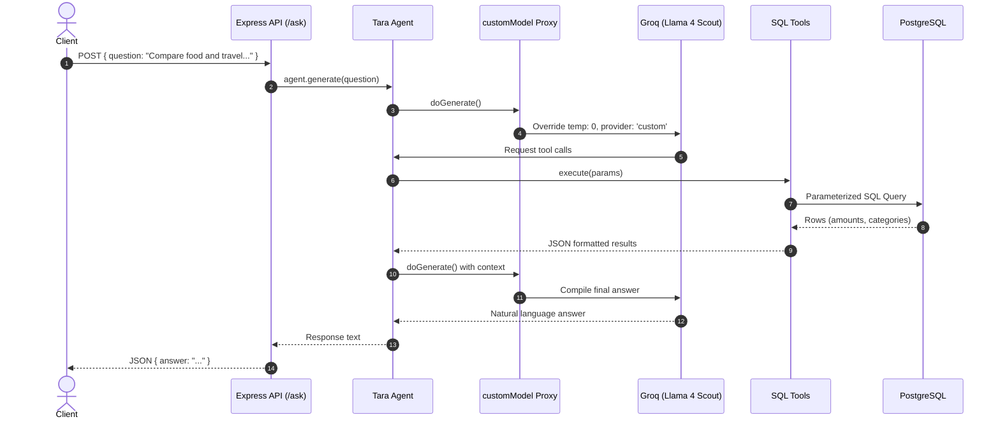
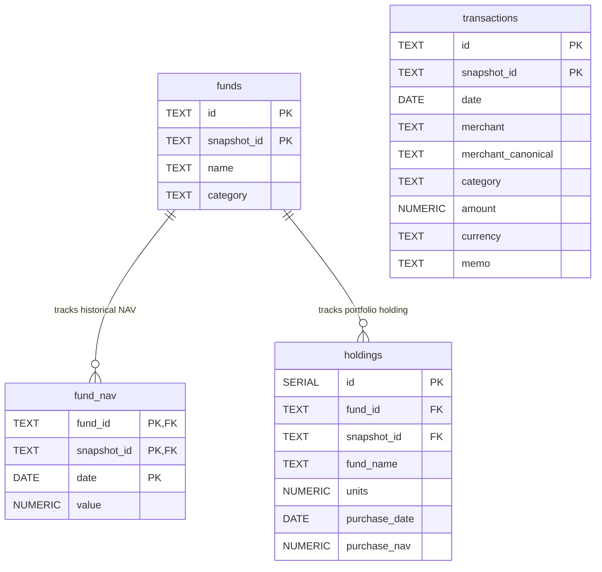

# DESIGN.md — Tara Finance AI Agent Spec

This document details the architecture, database schema, tool configurations, and grounding formulas for the **Tara Finance AI Agent**.

---

## 🏗️ System Architecture & Data Flow

Tara executes natural language financial commands through a deterministic, tool-grounded AI lifecycle.

---

## 🗄️ Database Design (PostgreSQL)

The database holds financial transactions, fund descriptions, NAV history, and user holdings. 

### Entity-Relationship Diagram

> [!NOTE]
> **Composite Keys & Idempotence**
> Primary keys for `transactions`, `funds`, and `fund_nav` use composite structures incorporating `snapshot_id`. This allows multiple independent datasets (like `sample_a`, `sample_b`, and `sample_c`) to coexist in the database without conflicts. The data ingestion pipeline is fully idempotent.

### Database Schema Design Notes
* **Logical Relationships**: The tables maintain a clear logical relationship where `fund_nav` and `holdings` link back to `funds(id, snapshot_id)`.
* **Index Configuration**: Indexes are defined on columns frequently filtered or sorted by (such as `date`, `category`, and `snapshot_id`) to ensure optimal tool query execution.

---

## 🛠️ Tool Specifications

Tara’s capability is divided across four distinct, domain-specific tools:

| Tool Name | Domain / Responsibilities | Target Table(s) |
|---|---|---|
| `query_transactions` | Handles spending, merchant analysis, and category breakdowns. | `transactions` |
| `query_fund_performance` | Calculates historical mutual fund NAVs and returns over time. | `fund_nav`, `funds` |
| `query_holdings` | Calculates user holdings, total portfolio values, and returns. | `holdings`, `fund_nav` |
| `detect_recurring` | Identifies potential monthly subscription services. | `transactions` |

> [!TIP]
> **Consolidated Transaction Queries**
> Rather than using narrow, single-purpose tools for category lookup, top merchant lookup, or sum aggregation, we group these behaviors into `query_transactions` under an `aggregate` parameter. This limits choice complexity for the LLM and boosts overall execution accuracy.

---

## 🧮 Grounding Formulas

### 1. Spending Aggregations
* **Gross Spend**: `SUM(amount) WHERE amount > 0`
* **Refund Reversals**: `SUM(amount) WHERE amount < 0`
* **Net Spend**: `SUM(amount)` (Automatically incorporates refunds)
* *Internal transfers (`category = 'transfer'`) are excluded from general spend sums.*

### 2. Merchant Normalization (Ingest-time)
To match fuzzy inputs (e.g. `SWIGGY*ORDER` and `Swiggy Instamart`), merchants are normalized when ingested:
> **Formula:**
> `merchant_canonical` = `first_token` ( `lowercase` ( `strip_special_chars` ( `merchant` ) ) )

### 3. Subscription & Recurring Detection
A merchant is flagged as recurring if it appears in at least $N$ distinct calendar months:
> **Formula:**
> `COUNT` ( `DISTINCT` `TO_CHAR` ( `date`, `'YYYY-MM'` ) ) $\ge$ `min_months`

### 4. Fund & Holding Returns
* **Mutual Fund Return (Period)**: 
  $$\text{Return (\%)} = \frac{\text{NAV}_{\text{end}} - \text{NAV}_{\text{start}}}{\text{NAV}_{\text{start}}} \times 100$$
* **Personal Holding Return**:
  > **Formulas:**
  > * `Purchase Cost` = `units` $\times$ `purchase_nav`
  > * `Current Value` = `units` $\times$ `latest_nav`
  > * `Realised Return` = `Current Value` $-$ `Purchase Cost`
  > * `Realised Return (%)` = `Realised Return` $/$ `Purchase Cost` $\times$ `100`

---

## 📋 Evaluation Coverage
The project includes a verification suite (`scripts/eval.ts`) testing 12 distinct functional scenarios:
1. Food spending lookup
2. Single largest expense queries
3. Fuzzy merchant matching (e.g. Swiggy)
4. Category exclusions (excluding internal transfers)
5. Recurring subscriptions detection
6. Clean no-data notifications
7. Total portfolio valuation
8. Realised investment returns
9. Date range NAV calculations and ranking
10. Comparative spending analysis (Food vs Travel)
11. MoM category variations
12. Net spending calculation after refunds

---

## 🚀 Known Limitations
* **Upstream LLM Quota Limits**: The Groq Free Tier has strict Daily Token Limits (TPD). Sustained concurrent requests may trigger temporary API rate limiting (HTTP 429).
* **Render Service Sleep**: On Render's Free tier, the web app sleeps after 15 minutes of inactivity, causing a ~30 second cold start delay on the first query.
